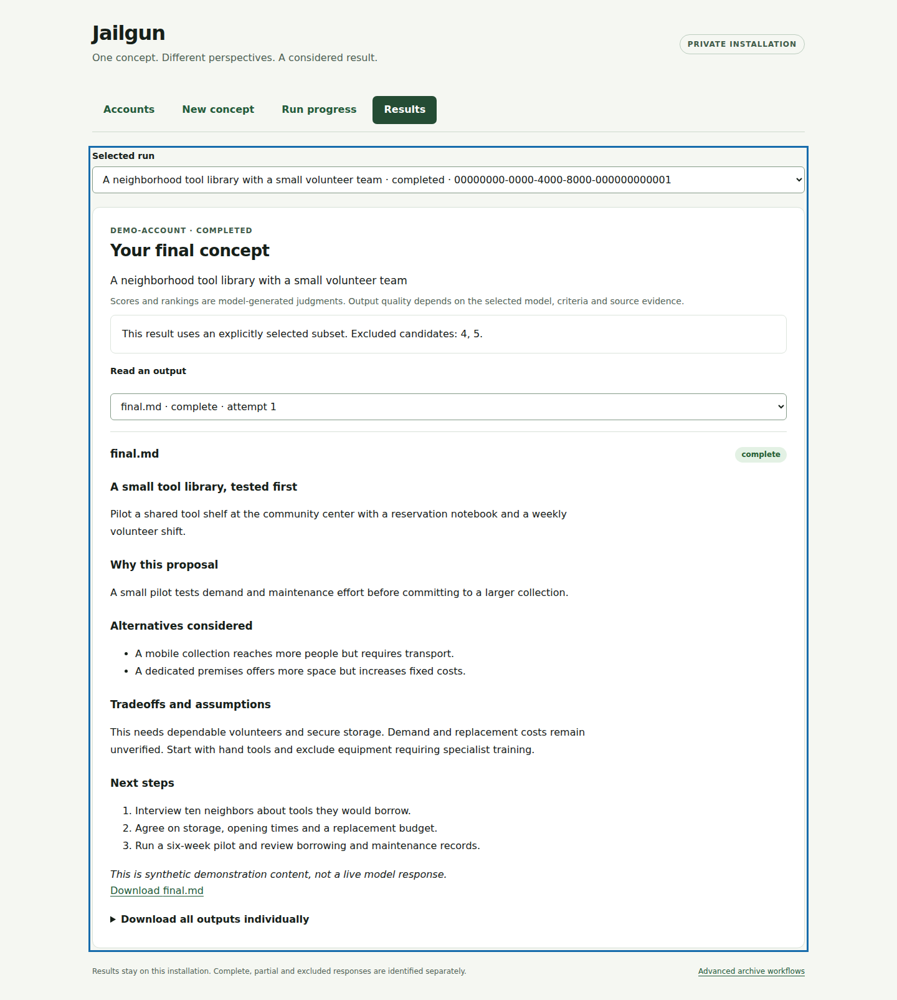

# Jailgun

Turn one concept into several distinct explorations, compare them, and develop a
revised final proposal through ChatGPT. Use the dashboard, CLI, or a standard MCP
client. Jailgun keeps conversations, results and recovery state on your machine.

**Concept → 5–10 explorations → comparison → synthesis → critique → revision.**

<!-- jankurai-badge:start -->
[](agent/repo-score.md)
<!-- jankurai-badge:end -->

**v0.2.0 is under development and has not been published.** The DREAM worker
delivery is Linux-only; worker acceptance does not complete the broader concept
application release. Clean-environment installation and full concept-workflow
live-provider acceptance remain release gates. The
[gap register](docs/public-release-progress.md) records what is verified.



*Actual Chromium screenshot with synthetic demonstration data. This example
explicitly continued with three complete candidates and excluded two. It is not
a live ChatGPT response. [Capture record](assets/dashboard-results.json).*

## Install and connect

You need Google Chrome and a ChatGPT account you control. Initial login uses the
website's normal interactive verification; Jailgun does not ask for your password
or verification code. Paid model API credentials are not used.

The DREAM worker targets Linux x86-64 (Ubuntu 24.04/26.04). Hosted platform CI
validates both Ubuntu versions. macOS packaging remains experimental and is not
part of this worker delivery or its required CI. The broader application release
ledger retains its separate cross-platform gates. Windows, other chat providers
and hosted multi-tenant operation are outside this delivery.

Install Git, curl, tar, Rust through [rustup](https://rustup.rs/), and a C compiler.
Then:

```bash
git clone https://github.com/neverhuman/jailgun.git
cd jailgun
bash scripts/bootstrap.sh
export PATH="$HOME/.local/bin:$PATH"
jailgun doctor
jailgun setup
```

Bootstrap installs pinned build tools, builds locked dependencies, and installs a verified
bundle into your user-owned prefix. Installed operation needs no source checkout,
Rust, or npm. See [installation](docs/install.md) for prerequisites, paths with
spaces, explicit dependency installation, and checksum-verified release archives
once v0.2.0 is published.

In the dashboard:

1. Open **Accounts**, connect ChatGPT, and complete login in its dedicated browser.
2. Confirm the detected account identity and choose an observed model or the
   account's current selection.
3. Open **New concept**, enter your concept and constraints, choose five to ten
   perspectives, and adjust the evaluation criteria if needed.
4. Follow **Run progress**, then open **Results** for the revised concept,
   comparison, critique, complete candidates and downloads.

The private browser profile is reused across restarts. If authentication expires,
reconnect from Accounts; completed work stays available. See the
[dashboard guide](docs/dashboard.md) for partial results and recovery choices.

## First CLI run

List accounts and use the ID of your verified account:

```bash
jailgun accounts list
jailgun brainstorm "A neighborhood tool library" --account YOUR_ACCOUNT_ID --tabs 5 --wait
```

Without `--wait`, submission returns a run ID immediately. With it, success
requires a completed final result. Inspect, export, pause or cancel with:

```bash
jailgun runs list
jailgun runs show RUN_ID
jailgun runs result RUN_ID
jailgun runs export RUN_ID --out "results/my concept"
jailgun runs pause RUN_ID
jailgun runs resume RUN_ID
jailgun runs cancel RUN_ID
```

Results and account state live under `~/.jailgun` by default. Exports contain
readable files, including `final.md` for completed runs, plus a manifest with
artifact hashes. Full responses stay available alongside structured summaries.
Use `--runtime` for another private local directory. See the [CLI reference](docs/cli.md),
[HTTP reference](docs/concept-http-api.md), and [backup/restore procedure](db/README.md).

## Use an MCP client

Create a scoped automation token in **Accounts → Automation access for CLI and
MCP**, save it in a private file, and configure your client:

```json
{
  "mcpServers": {
    "jailgun": {
      "command": "jailgun",
      "args": ["mcp", "--token-file", "/absolute/path/to/private-token"]
    }
  }
}
```

Use mode 0600 for the token file. The gateway connects to or safely starts the
local daemon. Account login remains an operator dashboard action. Authenticated
Streamable HTTP is available at `/mcp`; see [MCP configuration](docs/mcp.md) for
tools, schemas, transport settings and troubleshooting.

## DREAM lightweight worker

`jailgun worker` starts a lightweight browser-backed Rust MCP server for trusted agents. It
offers isolated logical tabs, idempotent jobs, Astra/Sol model aliases, explicit
`low` through `ultra` reasoning effort, bounded timeouts, selectable error
reporting, cancellation, and SHA-256-verified chunked tar.gz upload/download.
Production execution uses supervised ChatGPT website sessions—never Codex CLI
device authentication. Several authenticated AI accounts can coexist: each gets
a private Chrome profile and worker identity, tabs stay pinned to one account,
and MCP reports ready/relogin counts without exposing cookies or credentials.
CI injects a mock executor and never contacts a live model.

The worker binds loopback only. Remote clients use an SSH local forward and a
mode-0600 bearer credential; no token belongs in a URL. Start it with:

```bash
jailgun worker --runtime "$HOME/.jailgun-worker" --addr 127.0.0.1:8790
```

See the complete [Worker MCP guide](docs/worker-mcp.md) for client configuration,
all tools, account login/routing, model/effort controls, object chunking,
integrity checks, failure semantics, and mock-CI guarantees.

## Linux server setup

Install Chrome and the documented display prerequisites, then run:

```bash
jailgun doctor --server-browser
jailgun setup --server-browser --no-open
```

From your workstation, forward the dashboard through SSH:

```bash
ssh -N -L 8787:127.0.0.1:8787 user@your-server
```

Open the pairing link printed by setup and complete login in **Accounts → Open
login view**. The link works once and expires after five minutes. The private
viewer requires the paired operator session. See [server login](docs/server-login.md)
and [two-account setup](docs/HEADLESS_TWO_ACCOUNT_SETUP.md).

## Understand the result

Default evaluation weights are usefulness 30%, feasibility 25%, novelty 20%,
supporting evidence 15%, and risk management 10%. Scores are model-generated
judgments. Output quality depends on the selected model, criteria and source
evidence; review assumptions before acting on a proposal.

Starts are paced account-wide, with up to ten active conversations per account.
A failed or partial candidate cannot silently become complete. After bounded
retries, choose whether to retry, cancel, or explicitly continue with at least
three complete candidates. See [workflow behavior](docs/concept-workflows.md)
for limits, context budgets and retained outputs.

## Troubleshooting and development

- **Setup cannot start:** run `jailgun doctor` with the same runtime and display
  options. It identifies missing assets, Chrome or display dependencies.
- **Pairing expired:** rerun setup for a new link. No long-lived token belongs in
  a dashboard or WebSocket URL.
- **Login or model needs attention:** reconnect in Accounts and confirm the
  observed identity/model. A specific unavailable model is never substituted.
- **Interrupted run:** inspect Run progress or `runs show`; preserve uncertain
  submissions for reconciliation instead of sending the concept again.
- **Try the interface without an account:** open the built dashboard with
  `?demo=1`. It visibly uses synthetic data and cannot submit work.

Archive generation, `jailhard`, guarded deployment and optional notifications
remain [advanced workflows](docs/advanced-workflows.md). Concept submission never
enables deployment. Read [authentication changes](docs/authentication-upgrade.md)
before upgrading an older installation.

For development, read [AGENTS.md](AGENTS.md), [CONTRIBUTING.md](CONTRIBUTING.md), [architecture](docs/architecture.md),
[local CI](docs/ci-local.md), and [release procedure](docs/release.md). Run
`bash scripts/ci-local.sh` for the integrated local checks. Report vulnerabilities
through [SECURITY.md](SECURITY.md). Jailgun is [MIT licensed](LICENSE).
